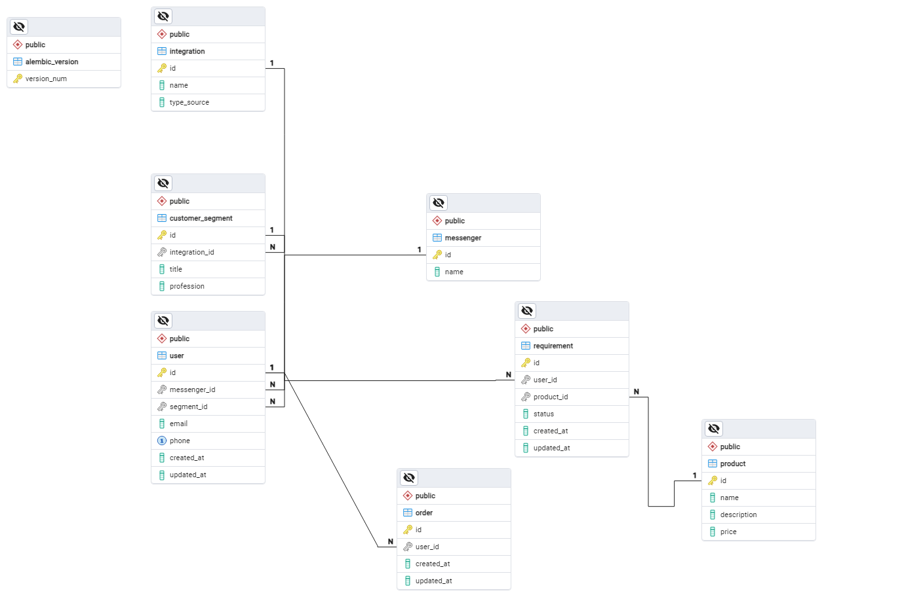

      

# Технологии
- [Python](https://www.python.org/)
- [Pydantic](https://docs.pydantic.dev/latest/)
- [SQLAlchemy](https://www.sqlalchemy.org/)
- [alembic](https://alembic.sqlalchemy.org/en/latest/)

# Описание
- User: Данные о пользователе. Какой мессенджер был использован. К каому клиентскому сегменту относиться.
- Requirement: Потребность клиента в каком-либо продукте. Статус потребности(обработана и тд.).
- Product: Информация о продукте.
- Order: Заказ, оформленный пользователем.
- CustomerSegment: Информация о сегменте. Откуда была сделана интеграция данного сегмента.
- Integration: Интеграция сегмента.
- Messenger: Информация о мессенджере, который был использован в ходе общения с пользователем.
